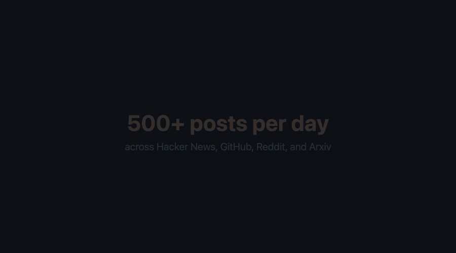

# Huginn

<p align="center">
  
</p>

I got tired of checking Hacker News, Reddit, GitHub, and Arxiv every day just to see if someone posted something I should know about. 500+ posts a day, and maybe 10 of them actually matter to what I'm working on. I was either spending an hour scrolling or missing things that mattered.

So I built a thing that reads all of it for me, figures out what's relevant, and sends me one Telegram message in the morning. If something blows up during the day or someone writes a comment I should respond to, it tells me right away.

It runs on your machine with a local AI model. Nothing goes to the cloud. You tell it what you care about in plain English and it does the rest.

## What you get

One message a day on Telegram. Summary of what happened, what's gaining traction, which conversations might be worth jumping into. Below that, every relevant link so you can click through.

Real-time pings when:
- A post in your area suddenly takes off
- Someone writes something you'd want to respond to
- Someone replies to your HN comment (HN doesn't do notifications)
- A new project shows up that's in your space
- One of your GitHub repos gets a release or stars spike

Weekly trend report. What topics grew, what faded, what launched.

Everything also saves as markdown files locally if you want to search later.

## Where it looks

| Source | How |
|--------|-----|
| Hacker News | Algolia API (free, no auth) |
| GitHub | API (free, optional token for higher limits) |
| Reddit | RSS feeds (free, no auth) |
| Arxiv | API (free, no auth) |

## How it knows what you care about

You describe it in `config.json`:

```json
"interests": [
  "Tools that help verify AI-generated code actually does what it's supposed to",
  "Security problems with npm packages, especially ones AI tools install automatically",
  "How AI is changing the day-to-day work of software engineers"
]
```

A local AI model (Ollama, runs on your machine) reads each post and decides if it matches. If yes, it summarizes the article and checks if the comments have anything interesting.

## Setup

Node.js 18+ and [Ollama](https://ollama.com).

```bash
git clone https://github.com/krzysztofdudek/Huginn.git
cd Huginn
npm install
ollama pull qwen3.5:9b

cp config.example.json config.json
cp secrets.example.json secrets.json
# edit config.json with your interests
# edit secrets.json with your Telegram bot token (see below)

npm test    # checks if everything connects
npm start   # go
```

### Telegram bot (2 min)

1. Open Telegram, find @BotFather, type `/newbot`, follow steps, get a token
2. Send your new bot any message
3. Open `https://api.telegram.org/botYOUR_TOKEN/getUpdates` in browser, find your chat ID
4. Put both in `secrets.json`

Skip this and everything just saves as local files instead.

### GitHub token (optional)

Without it: 60 API requests/hour. With it: 5,000. For most people 60 is fine.

GitHub > Settings > Developer settings > Fine-grained tokens > Public Repositories read-only.

## Config

Two files:

**`config.json`** (what to watch):

| Setting | What it does |
|---------|-------------|
| `startDate` | How far back on first run. `null` = today. `"2026-03-20"` = go back. |
| `interests` | The main thing. Plain language, what matters to you. |
| `tags` | Labels the classifier picks from. Match your vocabulary. |
| `hnUsername` | Your HN username. Get notified on replies. |
| `github.topics` | Topics to search for new repos. |
| `github.watchRepos` | Your repos or repos you follow. Stars and releases. |
| `reddit.subreddits` | Which subs to read. |
| `ollama.model` | `qwen3.5:9b` recommended. `qwen3.5:4b` if RAM is tight. |
| `delivery` | `"both"`, `"telegram"`, or `"file"`. |

**`secrets.json`** (tokens, gitignored):

```json
{
  "telegram": { "botToken": "...", "chatId": "..." },
  "github": { "token": "..." }
}
```

Everything optional. No subreddits? Reddit skipped. No Telegram? Files only. Nothing crashes.

## Commands

```
npm start                                  Collect, analyze, deliver, keep going
npm run once                               One cycle, then stop
npm test                                   Check all connections
npm run status                             What's in the database
npm run briefing                           Force today's briefing now
npm run trend                              Force this week's trend
npm run reset                              Wipe analysis, keep data
node src/index.js --backfill 2026-03-20    Go back and get older stuff
node src/index.js --help                   All options
```

## How it handles downtime

Ctrl+C anytime. Picks up where it left off. Didn't run for 3 days? Catches up and gives you 3 separate daily briefings when you restart. Ollama crashes? Data keeps collecting, analysis queues up. Telegram down? Saves to files, sends when it's back.

## What it creates

```
data/db            Everything collected and analyzed
data/huginn.log    What happened when
output/            Briefings and alerts as markdown
```

## License

MIT
